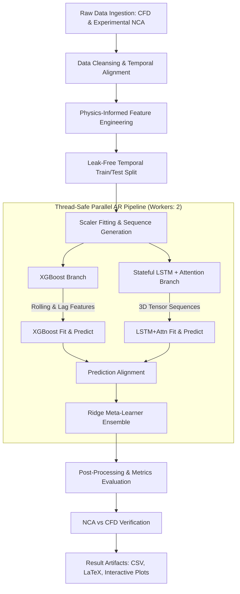

# PCM-Enhanced Battery Thermal Management: A Hybrid SOTA Ensemble Approach

**Comprehensive Code Workability & Logical Simulation Flow Documentation**

## 1. Introduction & Simulation Context

This document outlines the architecture, data pipeline, and predictive workflow of the **Conjugate Heat Transfer (CHT)** hybrid ensemble model designed for PCM-enhanced battery thermal prediction. The framework integrates an extreme gradient boosting model (XGBoost) with a deep stateful Long Short-Term Memory network utilizing Multi-Head Attention (LSTM+Attention), combined via a Ridge Regression ensemble mechanism.

### 1.1 Simulation Parameters

- **Phase Change Material (PCM)**: RT-45 Nano-enhanced PCM (NePCM)
- **Reynolds Number ($Re$)**: 1000
- **Initial Boundary Temperature ($T_0$)**: 300 K
- **Ambient Temperature ($T_{amb}$)**: 298.15 K
- **Battery Specification**: 3.7V EV cell (Panasonic NCR18650B NCA) modeled via ANSYS Conjugate Heat Transfer.
- **Geometrical Aspect Ratios (AR)**: 0.3, 0.4, 0.5
- **Target Variable**: $T_{battery}$ (Bulk Battery Temperature in Kelvin)

---

## 2. Strict Data Leakage Prevention Policy

A fundamental pillar of this modeling approach is the rigorous prevention of data leakage to ensure true out-of-sample predictive robustness:

1. **Target Isolation**: $T_{battery}(t)$ is **never** used as an input feature. The model relies strictly on lagged variations, primarily $T_{battery}(t-1)$ denoted as `T_bat_lag1`.
2. **Train-Only Scaling**: `MinMaxScaler` objects are fitted exclusively on the training split and statically transformed onto the validation and test sets.
3. **Temporal Splitting**: Validation datasets are carved sequentially from the _end_ of the training window, never shuffled from the test window.
4. **Causal Cumulative Features**: Cumulative sum calculations (e.g., `cumul_heat`) are calculated independently on train and test arrays after the temporal split to prevent future data interpolation.

---

## 3. Logical Simulation Flow & Due Process

The codebase operates in a highly parallelized, thread-safe architecture utilizing Python's `concurrent.futures.ThreadPoolExecutor`.

### 3.1 Flowchart of the Execution Pipeline

### 3.2 Physics-Informed Feature Engineering (Equations)

To allow the machine learning models to capture complex thermodynamic behavior without direct structural simulation, several deterministic physics-informed features are engineered:

1. **Temperature Differential (Lagged)**
   $$ \Delta T*{lag1} = T*{battery}(t-1) - T\_{pcm}(t-1) $$

2. **Heat Flux Surrogate**
   $$ q''_{lag1} = Nu(t-1) \times \Delta T_{lag1} $$

3. **Cumulative Heat Dissipation**
   $$ Q*{cumul}(t) = \sum*{i=0}^{t} q''\_{lag1}(i) $$

4. **Experimental Proxy Derivations (Validation Dataset)**
   $$ T*{surface, K} = T*{surface, ^\circ C} + 273.15 $$
   $$ \Delta T*K = T*{surface, K} - 298.15 $$
   $$ SoC*{proxy} = \frac{V(t) - 2.5}{4.2 - 2.5} $$
   $$ P*{heat} = V(t) \times |I(t)| $$

---

## 4. Model Architecture Details

### 4.1 XGBoost Sub-Model

The XGBoost branch processes an extended feature space containing lag/rolling variants of the base physics variables (up to 50 timesteps lag).

- **Hyperparameters**: `n_estimators=600`, `learning_rate=0.04`, `max_depth=7`, `subsample=0.8`
- **Objective Function**: `reg:squarederror`
- **Role**: Captures high-frequency, non-linear instantaneous interactions and acts as a strong baseline predictor.

### 4.2 Stateful LSTM + Multi-Head Attention Sub-Model

The deep learning branch processes raw sequential data via 3D tensors `[batch_size, seq_steps, features]`.

- **Core Engine**: Three stacked Stateful LSTM layers (`256` units each, `tanh` activation) mapping temporal propagation.
- **Attention Mechanism**: `MultiHeadAttention` (4 heads, key dimension 64) allows the network to differentially weight past critical thermal events (e.g., phase transition initiation).
- **Dense Head**: Layer Normalization followed by Dense layers (`[128, 64]`) outputting the deterministic target.
- **Loss**: `Huber` (robust to thermal spikes/noise).

### 4.3 Ridge Regression Ensemble (Meta-Learner)

A Ridge Regression model ($\alpha = 1.0$) acts as a meta-learner. It takes the output vectors of both XGBoost and LSTM predictions over an aligned temporal index and dynamically weights them to minimize final residual errors.

---

## 5. Model Features & Strengths

1. **Thread-Safe Parallelism**: Processes multiple geometrical aspect ratios concurrently. Deep learning backend graph fragmentation is prevented by invoking `tf.keras.backend.clear_session()` per thread execution.
2. **Hybrid Efficacy**: Successfully bridges the gap between gradient tree boosting (excellent at tabular non-linear thresholding) and deep recurrent networks (superior at long-term temporal dependencies).
3. **Hardware-Agnostic Scaling**: Carefully tuned memory footprints (`MAX_PARALLEL_AR = 2`) preventing RAM overflow and thread thrashing during heavy Keras object instantiations.
4. **Comprehensive Diagnostic Suite**: Out-of-the-box support for generating Pearson correlations, absolute error distributions, feature importance tracking, and LaTeX table synthesis.

---

## 6. Limitations

1. **Static Pre-Calculated CFD Dependency**: The model relies on accurate upstream simulation data (Nu, Liquid Fraction). It is highly interpolative but may exhibit degraded confidence when extrapolating to heavily deviant physical scenarios (e.g., $Re \gg 1000$).
2. **Fixed Temporal Resolution**: The Stateful LSTM is highly sensitive to the temporal sampling frequency. Disjointed, irregular, or varying step sizes in new experimental datasets require aggressive interpolation before inference.
3. **Cold Start Penalty**: The 300-step sequence requirement for the LSTM dictates that the first 300 timesteps of any new inference batch operate with padded or limited historical memory.

---

## 7. Possible Inclusions for Further Studies

1. **Electrochemical-Thermal Coupling**: Integrating real-time state-of-charge (SoC) degradation scalars and internal resistance ($R_{int}$) estimators as dynamic inputs, bridging empirical NCA telemetry continuously with the CFD outputs.
2. **Physics-Informed Neural Networks (PINNs)**: Altering the LSTM Huber loss function to penalize violations of the Navier-Stokes or Energy Conservation partial differential equations (PDEs), creating a strictly bounded thermodynamic predictive space.
3. **Adaptive Sequence Lengths**: Implementing Transformer-XL or state-free causal temporal convolutions (TCNs) to remove the rigid `SEQ_STEPS = 300` constraint, allowing variable-length real-time predictive horizons.
4. **Multi-Chemistry Generalization**: Expanding the training matrix beyond the NCA domain (e.g., LFP, NMC, LCO datasets) using domain adaptation techniques (Transfer Learning) to map the existing model weights to new thermal profiles.
