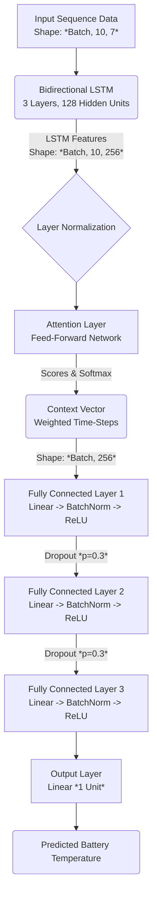

# Model Architecture Flowchart

## Explaining the Core Concepts

### 1. Sequences & Features (The Input)
The network relies on sequences of past data. Your sequence length is set to `10`, meaning to predict a single temperature value at time step $t$, the network is explicitly looking at the past 10 time steps. Your feature size is `7` (aspect ratio, liquid fraction, Nu, T_pcm, rolling fraction, rolling Nu, and temperature difference) containing engineered sliding windows perfectly suited for capturing momentum in thermodynamics.

### 2. Bidirectional LSTM (BiLSTM)
A standard Recurrent Neural Network looks at data strictly chronologically ($t_1 \rightarrow t_2 \rightarrow t_3$). A **Bidirectional LSTM**, however, passes sequences sequentially forward *and* backward at the same time. Since thermal propagation is contiguous, this ensures the model isn't just reacting to what happened in the past, but framing predictions based on the future context within that specific 10-step sequence window. `3 layers` ensures massive depth for highly complex nonlinear representations. 

### 3. Layer Normalization
Placed immediately after the LSTM output sequence, this standardizes features across each time-step for the individual sequence. It ensures that massive spikes in temporary inputs (like an abrupt jump in phase change boundaries) don't uncontrollably explode the activation gradients before they reach the rest of the network. 

### 4. The Custom Attention Mechanism
Without an attention layer, a basic LSTM sequence model essentially treats all 10 historical timesteps as equally important and averages them out, which is untrue for heat transfer equations where recent steps are more predictive. 
The custom neural attention layer `(Linear -> Tanh -> Linear -> Softmax)`:
1. Calculates an "importance score" for every single step in your 10-sequence length.
2. Squeezes those scores to values between `0` and `1` (Softmax) so they act as percentages.
3. Multiplies the LSTM outputs by these percentages to aggressively weigh the most critical specific points in time. 

### 5. Fully Connected Layers & Dropout
The "Context Vector" produced by the attention block is passed into a progressively shrinking Dense network (`256 -> 128 -> 64 -> 32 -> 1`). 
Throughout these layers, **Dropout (p=0.3)** is strategically placed. Dropout acts as a regularization technique by randomly "turning off" 30% of the neurons during every single training step. This brutally prevents the network from memorizing the specific training data points (overfitting) by forcing it to establish redundant pathways to find the answer.

### 6. Huber MSE Loss (The Criterion)
Instead of trusting standard regression training calculations like `Mean Squared Error (MSE)`, your configuration leverages a custom `HuberMSELoss`.
* Standard `MSE` severely penalizes large anomalies. In PCM thermal prediction, anomalous spikes occasionally exist in correct truth data. Severe penalties for these can rapidly destabilize the neural network parameters in training.
* Huber Loss acts like standard MSE for tiny errors, but transitions to a linear `Absolute Error` penalty for large outliers. This combination makes the model exceptionally smooth and robust, gracefully gliding through thermal noise.
