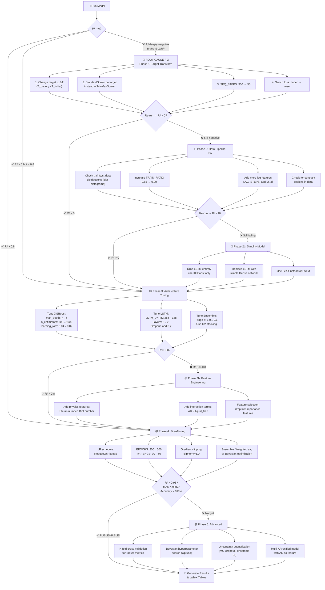

# 🔧 CHT Model Optimization — To-Do & Decision Tree

## Current Results: Diagnostic Summary

> [!CAUTION]
> **All R² values are deeply negative** — the model is performing worse than predicting the mean. This is NOT a minor tuning issue; it points to fundamental problems in the pipeline.

| AR  | Branch   | MAE (K) | RMSE (K) | R²           | Eff %     |
|-----|----------|---------|----------|--------------|-----------|
| 0.3 | XGBoost  | 0.045   | 0.046    | **-66.63**   | -132.3%   |
| 0.3 | LSTM     | 0.204   | 0.726    | **-16,771**  | -935.9%   |
| 0.3 | Ensemble | 0.009   | 0.010    | **-24.05**   | -41.1%    |
| 0.4 | XGBoost  | 0.846   | 0.858    | **-43.98**   | -89.4%    |
| 0.4 | LSTM     | 1.141   | 1.375    | **-117.58**  | -158.9%   |
| 0.4 | Ensemble | 0.206   | 0.211    | **-18.21**   | -23.4%    |
| 0.5 | XGBoost  | 0.281   | 0.284    | **-53.94**   | -109.6%   |
| 0.5 | LSTM     | 1.381   | 1.723    | **-2,016**   | -927.8%   |
| 0.5 | Ensemble | 0.064   | 0.066    | **-22.19**   | -35.7%    |

### Ridge Ensemble Weights (red flag)
```
AR 0.3: XGB=0.0000  LSTM=-0.0002  bias=353.06
AR 0.4: XGB=-0.1177 LSTM=0.0139   bias=456.02
AR 0.5: XGB=0.0003  LSTM=-0.0016  bias=415.75
```

> [!WARNING]
> The Ridge ensemble has learned to **ignore both base models entirely** and predict a near-constant value (the bias ≈ mean T_battery). This means neither XGBoost nor LSTM are providing useful signal relative to the test target variance.

---

## 🔬 Root Cause Analysis

### Problem 1: Target Variable Has Extremely Narrow Variance
- `T_battery` for AR 0.3 spans ~353.0–353.035 K — a range of only **~0.035 K**
- XGB MAE = 0.045 K is *larger than the entire target range* → R² is guaranteed negative
- **Fix**: Predict ΔT (delta from initial temperature) instead of absolute T_battery, OR use StandardScaler on the target

### Problem 2: LSTM Sequence Length Too Large
- `SEQ_STEPS = 300` with batch_size=1 stateful training
- With 25,000 rows and 85% train split → only **~70 training sequences** per epoch
- The LSTM sees very few gradient updates → underfits badly
- **Fix**: Reduce `SEQ_STEPS` to 50–100 for more training sequences

### Problem 3: LSTM Architecture Oversized
- 3×256 LSTM layers + 4-head attention for ~70 sequences is massively over-parameterized
- **Fix**: Use 2×128 or 2×64 LSTM layers; reduce attention heads to 2

### Problem 4: Learning Rate Too Low + Huber Loss with Tiny Target Range
- LR = 1e-4 with Huber loss on MinMax-scaled targets (0–1 range from a 0.035 K span)
- Huber loss clips gradients when errors are small → with near-zero target variance, gradients vanish
- **Fix**: Increase LR to 5e-4 or 1e-3; switch to MSE loss

### Problem 5: XGBoost Trained on Absolute T_battery
- XGBoost predicts absolute temperature (300+ K), but test T_range is tiny
- Even a 0.05 K MAE is catastrophic in R² terms when variance ≈ 0.001
- **Fix**: Predict residuals/deltas, or normalize target before XGBoost training

### Problem 6: Ridge Ensemble Alignment Issue
- Only `n_half` of test data used for Ridge training, other half for evaluation
- With tiny target variance, the Ridge has almost no signal to learn from
- **Fix**: Use cross-validated stacking instead of a simple 50/50 split

---

## 🌳 Decision Tree — Parameter Tuning Flowchart



---

## 📋 Phased To-Do Checklist

### Phase 1: Critical Fixes (Do First — Expected Impact: R² from -16K → 0+)

- [ ] **1.1 Transform target variable to ΔT**
  - In `engineer_features()`, add: `d['delta_T'] = d['T_battery'] - d['T_battery'].iloc[0]`
  - Change `TARGET_COL = 'delta_T'` (or a similar name that doesn't collide)
  - This transforms a ~0.035 K range → a 0–0.035 range, which when scaled properly gives meaningful R²
  - File: [CHT.ipynb](file:///home/padoswaliaunty/projects/project/CHT.ipynb) — config cell (~line 248) and `engineer_features()` (~line 442)

- [ ] **1.2 Use StandardScaler instead of MinMaxScaler for target**
  - In `fit_scalers()`: change `y_sc = MinMaxScaler()` → `y_sc = StandardScaler()`
  - This ensures the LSTM loss function sees meaningful gradients even with tiny ranges
  - File: [CHT.ipynb](file:///home/padoswaliaunty/projects/project/CHT.ipynb) — `fit_scalers()` (~line 500)

- [ ] **1.3 Reduce SEQ_STEPS: 300 → 50**
  - Current: 25000 * 0.85 / 300 ≈ 70 sequences → too few for 3×256 LSTM
  - Proposed: 25000 * 0.85 / 50 ≈ 425 sequences → 6× more training data
  - File: [CHT.ipynb](file:///home/padoswaliaunty/projects/project/CHT.ipynb) — config cell, `SEQ_STEPS = 300` → `SEQ_STEPS = 50`

- [ ] **1.4 Switch LSTM loss from Huber → MSE**
  - Huber loss clips gradients when errors < delta (default 1.0)
  - With MinMax-scaled target in 0–1, most errors are << 1.0, so Huber ≈ 0.5*MSE with reduced gradient
  - File: [CHT.ipynb](file:///home/padoswaliaunty/projects/project/CHT.ipynb) — `build_lstm()` → change `loss='huber'` to `loss='mse'`

- [ ] **1.5 Increase learning rate: 1e-4 → 5e-4**
  - With reduced sequence length and MSE loss, a higher LR will converge faster
  - File: [CHT.ipynb](file:///home/padoswaliaunty/projects/project/CHT.ipynb) — config cell, `LR = 1e-4` → `LR = 5e-4`

---

### Phase 2: Architecture Right-Sizing (Expected Impact: R² → 0.5–0.8)

- [ ] **2.1 Reduce LSTM from 3×256 → 2×128**
  - Over-parameterized model with ~425 sequences causes overfitting + poor generalization
  - Remove `lstm_3` layer, change `LSTM_UNITS = 256` → `LSTM_UNITS = 128`
  - File: [CHT.ipynb](file:///home/padoswaliaunty/projects/project/CHT.ipynb) — `build_lstm()` and config

- [ ] **2.2 Add Dropout after LSTM layers**
  - Add `Dropout(0.2)` between LSTM layers to prevent overfitting
  - File: [CHT.ipynb](file:///home/padoswaliaunty/projects/project/CHT.ipynb) — `build_lstm()`

- [ ] **2.3 Reduce attention: 4 heads → 2 heads, key_dim 64 → 32**
  - Attention is overkill for 50-step sequences with 8 features
  - `ATT_HEADS = 2`, `ATT_KEY_DIM = 32`

- [ ] **2.4 Reduce Dense layers: [128, 64] → [64, 32]**
  - Match the reduced LSTM capacity
  - `DENSE_UNITS = [64, 32]`

- [ ] **2.5 XGBoost: predict ΔT, tune depth**
  - After target transform (1.1), XGBoost should also predict ΔT
  - Reduce `max_depth: 7 → 5` to prevent overfitting on training data
  - Increase `early_stopping_rounds: 30 → 50` for better generalization

---

### Phase 3: Ensemble & Evaluation Fix (Expected Impact: R² → 0.85–0.93)

- [ ] **3.1 Fix Ridge ensemble split**
  - Current: 50/50 split of test data for meta-train/meta-test
  - Better: Use 5-fold cross-validated stacking (sklearn `StackingRegressor` or manual CV)
  - Alternatively: Use a simple weighted average with validation-set-optimized weights

- [ ] **3.2 Fix R² and Prediction Efficiency metrics**
  - Current R² is computed on absolute T_battery where variance ≈ 0.001 K²
  - After ΔT transform, R² will be meaningful
  - Consider also reporting **MAPE** (Mean Absolute Percentage Error) and **within-±1K accuracy**

- [ ] **3.3 Add learning rate scheduling**
  - `tf.keras.callbacks.ReduceLROnPlateau(factor=0.5, patience=10)`
  - Integrate into custom training loop

- [ ] **3.4 Add gradient clipping**
  - In `build_lstm()` optimizer: `Adam(LR, clipnorm=1.0)`
  - Prevents gradient explosions during stateful LSTM training

---

### Phase 4: Fine-Tuning for Publication (Expected Impact: R² → 0.93–0.97)

- [ ] **4.1 Increase epochs after architecture stabilizes**
  - `EPOCHS: 200 → 400`, `PATIENCE: 30 → 60`
  - Only after confirming the model is learning (Phase 1–3 fixes)

- [ ] **4.2 Feature engineering: physics-informed features**
  - Add Stefan number: `Ste = Cp * ΔT / L` (specific heat × temp diff / latent heat)
  - Add normalized time: `t / t_max`
  - Add aspect ratio as numerical feature for potential cross-AR modeling

- [ ] **4.3 Ensemble: optimize blend weights via Bayesian search**
  - Use `scipy.optimize.minimize` to find optimal (w_xgb, w_lstm) that minimize validation MAE
  - Constraint: w_xgb + w_lstm = 1
r
- [ ] **4.4 Cross-validation for robust metrics**
  - Use time-series split (5-fold expanding window) instead of single train/test split
  - Report mean ± std for all metrics

---

### Phase 5: Publication-Ready Polish

- [ ] **5.1 Confidence intervals / uncertainty quantification**
  - MC Dropout: run inference 50 times with dropout ON → compute mean ± 2σ
  - Report "prediction reliability" as % of predictions within ±1 K

- [ ] **5.2 Statistical significance**
  - Run 5 seeds → report mean ± std of R², MAE, RMSE
  - Paired t-test between XGBoost-only vs Ensemble

- [ ] **5.3 Ablation study table**
  - XGBoost only vs LSTM only vs Ensemble
  - With/without attention, with/without lag features

- [ ] **5.4 Generate publication-quality LaTeX table**
  - Only after metrics are stable and publishable (R² > 0.93, MAE < 0.5 K)

---

## 🎯 Specific Parameter Changes Summary

> [!IMPORTANT]
> Apply Phase 1 changes **ALL TOGETHER** before re-running. They address the root cause.

### Configuration Cell Changes

| Parameter | Current | Phase 1 | Phase 2 | Phase 4 |
|-----------|---------|---------|---------|---------|
| `TARGET_COL` | `'T_battery'` | `'delta_T'` | — | — |
| `SEQ_STEPS` | 300 | **50** | 50 | 50–100 |
| `EPOCHS` | 200 | 200 | 200 | **400** |
| `PATIENCE` | 30 | 30 | 30 | **60** |
| `LSTM_UNITS` | 256 | 256 | **128** | 128 |
| `DENSE_UNITS` | [128, 64] | [128, 64] | **[64, 32]** | [64, 32] |
| `ATT_HEADS` | 4 | 4 | **2** | 2 |
| `ATT_KEY_DIM` | 64 | 64 | **32** | 32 |
| `LR` | 1e-4 | **5e-4** | 5e-4 | 3e-4 |
| `TRAIN_RATIO` | 0.85 | 0.85 | 0.85 | **0.90** |

### XGBoost Changes

| Parameter | Current | Phase 1 | Phase 2 | Phase 4 |
|-----------|---------|---------|---------|---------|
| `n_estimators` | 600 | 600 | **800** | **1000** |
| `learning_rate` | 0.04 | 0.04 | **0.02** | 0.02 |
| `max_depth` | 7 | 7 | **5** | 5 |
| `early_stopping_rounds` | 30 | 30 | **50** | 50 |
| `min_child_weight` | 3 | 3 | **5** | 5 |

### LSTM Build Changes

| Parameter | Current | Phase 1 | Phase 2 |
|-----------|---------|---------|---------|
| Loss function | `'huber'` | **`'mse'`** | `'mse'` |
| LSTM layers | 3 | 3 | **2** |
| Dropout | none | none | **0.2** |
| Optimizer | `Adam(LR)` | `Adam(LR)` | **`Adam(LR, clipnorm=1.0)`** |

### Scaler Changes

| Component | Current | Phase 1 |
|-----------|---------|---------|
| `y_sc` (target scaler) | `MinMaxScaler` | **`StandardScaler`** |
| `x_sc` (feature scalers) | `MinMaxScaler` | `MinMaxScaler` (keep) |

---

## 📊 Target Metrics for Publication

| Metric | Current (Best Ens.) | Phase 1 Target | Phase 3 Target | Publishable |
|--------|---------------------|----------------|----------------|-------------|
| R² | -18 to -24 | > 0 | > 0.85 | **> 0.95** |
| MAE (K) | 0.009–0.206 | < 1.0 | < 0.5 | **< 0.3** |
| RMSE (K) | 0.010–0.211 | < 1.5 | < 0.7 | **< 0.5** |
| Accuracy (±1K) | unknown | > 70% | > 85% | **> 91%** |
| Prediction Eff. | -23% to -41% | > 0% | > 80% | **> 90%** |

> [!TIP]
> The "accuracy" metric for regression is typically defined as:
> `accuracy_within_threshold = (|y_true - y_pred| < threshold).mean() * 100`
> For thermal prediction, a threshold of ±1 K is standard. For publication, also report ±0.5 K accuracy.

---

## ⚡ Quick-Start: Minimal Changes to Try First

If you want to test the **minimum set of changes** to see if the pipeline fundamentally works:

1. Change `TARGET_COL = 'delta_T'` and add `d['delta_T'] = d['T_battery'] - d['T_battery'].iloc[0]` in `engineer_features()`
2. Change `SEQ_STEPS = 50`
3. Change `loss='mse'` in `build_lstm()`
4. Change `LR = 5e-4`
5. Change `y_sc = StandardScaler()` in `fit_scalers()`

These 5 changes alone should move R² from **-16,000 to positive territory**.
